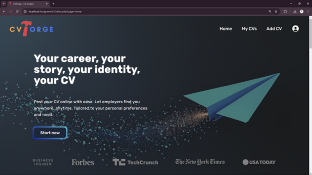
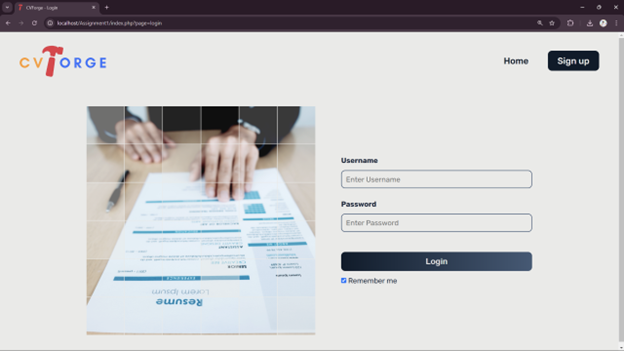
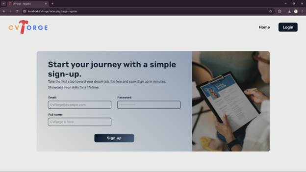
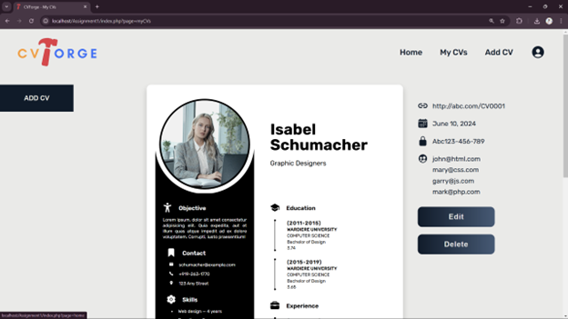

# CVForge 📄  

**CVForge** is a web-based application that enables jobseekers to create and share their CVs (résumés) online. This is a group project of my Web Programming course (CO3050), emphasizing efficient CV management, with my primary responsibility being the development of the **frontend** using **HTML**, **CSS**, and **JavaScript**.  

## Features 🌟  

**Jobseeker Role**  
- Post a CV:  
  - Fill out a form to provide details such as contact information, education, certificates, and other relevant information.  
  - Optionally upload a CV in PDF format.  

**Viewer Role**  
- View a CV:  
  - Access a specific CV using a unique URL (e.g., `http://abc.com/CV_id`).  
  - Authenticate to control access, ensuring privacy and security.  

## Specifications 📋  

1. CV Input Form:  
   A user-friendly interface allows jobseekers to enter their CV details efficiently.  

2. Dynamic URLs:  
   Each CV is assigned a unique URL for easy sharing.  

3. Authentication:  
   Access controls ensure that CVs remain private and accessible only to authorized viewers.  

4. Database Integration:  
   - CV details are securely stored in a database.  
   - CVs are retrieved and displayed based on a unique `CV_id`.  

5. CV Structure:  
   - Contact Information: Includes addresses and phone numbers.  
   - Education: Covers degrees and certificates.  
   - Additional Details: Features skills and work experience.

_Specification and report of the project are included as PDFs._

## Technologies Used 🛠️  

**Frontend**:  
- HTML5  
- CSS3  
- JavaScript  

**Backend**:  
- PHP  
- MySQL  

**Development Environment**:  
- XAMPP  

## Usage Instructions 🚀  

1. Jobseeker Workflow:  
   - Navigate to the "Post a CV" page.  
   - Complete the form with all relevant details.  
   - Optionally upload a CV in PDF format.  
   - Submit the form to store the CV in the database.  

2. Viewer Workflow:  
   - Access the CV by entering its unique URL in the address bar (e.g., `http://abc.com/CV_id`).  
   - Authenticate if required.  
   - View the CV details displayed on-screen.  

## Deployment 🌐  

The project was developed locally using **XAMPP** and can is deployed online for broader accessibility at [CVForge on InfinityFree](http://cvforge.ct.ws/)  

## Screenshots 📸  

**Home Page**  
  

**Login Page**  
  

**Sign Up Page**  
  

**View Page**  
  

---

Feel free to explore, contribute, and enhance the project! 🚀  
